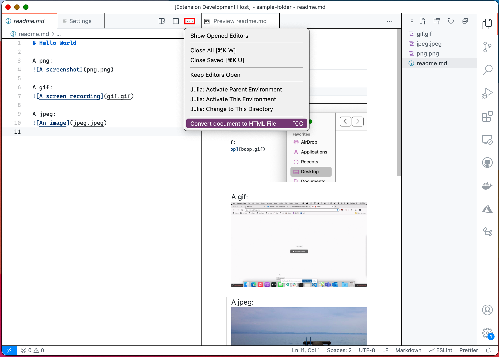

# Convert a Markdown Document to HTMl

Convert markdown documents to HTML files that can be opened or transfererred as single files, no need for a web server or bundling a whole directory.

## Usage

First, open a .md file that with relative references to images in the form:

```md
A png:
 # the image is located at png.png, in the same directory as the markdown file

A gif:
 # the image gif.gif is in a `media` directory along side the markdown file

A jpeg:

```

Note the images must be in your workspace, `http` links will not be included.

Then, run the command `MD to HTML: Convert Document to HTML` from either the command paalette or the editor action bar:


An HTML document will be created alongside the markdown file. This can be sent to anyone as a single and opened without bundling the images alongside or starting up a web server.
